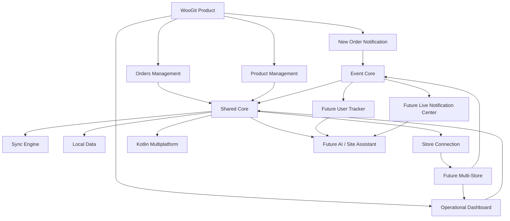

# WooGit — Project Documentation Map

این فایل نقشه‌ی مرکزی مستندات پروژه است. قبل از هر تصمیم معماری، قابلیت جدید یا تغییر مهم، باید مشخص شود تصمیم مربوط به کدام سند است.

## Source of Truth

### 1. PRODUCT_VISION.md
مرجع اصلی «چه چیزی می‌سازیم و چرا؟»

شامل:
- سه محور اصلی محصول
- اولویت و فوریت هر محور
- اهداف UX
- داشبورد
- Multi-Store vision
- اصل عدم حذف قابلیت‌های قبلی

### 2. ARCHITECTURE.md
مرجع اصلی «چطور باید ساخته شود؟»

شامل:
- Core-Out Architecture
- KMP
- Clean Architecture
- Local-first / Offline-first
- Sync Engine
- Data Versioning
- Store isolation
- AI/Assistant boundary

### 3. NOTIFICATIONS_AND_EVENTS.md
مرجع اصلی «رویدادها و اعلان‌ها چگونه باید طراحی شوند؟»

شامل:
- New Order Notification
- Event-driven Core
- Notification Center
- Live information
- User Tracker
- Login events
- Event subscriptions/preferences
- Multi-Store event source
- Chatbot/Site Assistant integration boundary

### 4. ORDERS_AND_PRODUCTS.md
مرجع اصلی نیازمندی‌های عملیاتی سفارش و محصول.

باید شامل:
- خلاصه سفارش
- جزئیات کامل سفارش
- عملیات سفارش
- مدیریت کامل محصول
- افزودن سریع محصول
- ویرایش سریع محصول

### 5. SECURITY_AND_PERMISSIONS.md
مرجع احراز هویت، نقش‌ها، سطح دسترسی، امنیت Store Connection و حریم خصوصی.

### 6. ROADMAP.md
مرجع اولویت نسخه‌ها و اینکه چه چیزی در V1، بعد از V1 و در آینده فعال می‌شود.

## قوانین مدیریت مستندات

1. README نباید تبدیل به محل نگهداری تمام جزئیات شود.
2. README فقط معرفی پروژه و لینک/راهنمای ورود به مستندات است.
3. هیچ قابلیت موجود بدون تصمیم صریح حذف نمی‌شود.
4. هر قابلیت آینده باید دو وضعیت داشته باشد:
   - معماری از امروز آماده باشد.
   - فعال‌سازی/پیاده‌سازی در نسخه‌ی مناسب انجام شود.
5. تصمیم‌های متناقض باید در یک سند واحد حل شوند؛ نباید یک تصمیم در چند فایل با متن متفاوت تکرار شود.
6. اگر یک تصمیم روی چند بخش اثر دارد، سند اصلی آن تصمیم باید مشخص باشد و سایر فایل‌ها فقط به آن ارجاع دهند.
7. هر پاسخ جدید کاربر که یک تصمیم محصولی یا معماری محسوب شود، باید قبل از ادامه‌ی سؤال بعدی در سند مربوط ثبت شود.
8. تغییرات مستندات باید commit جداگانه و با پیام واضح انجام شوند.

## Knowledge Graph

برای پروژه یک مدل ذهنی/گراف دانش سبک نگه می‌داریم، اما فعلاً آن را به‌صورت یک فایل Mermaid نگه می‌داریم تا بدون ابزار خارجی قابل مشاهده و نسخه‌بندی باشد.

