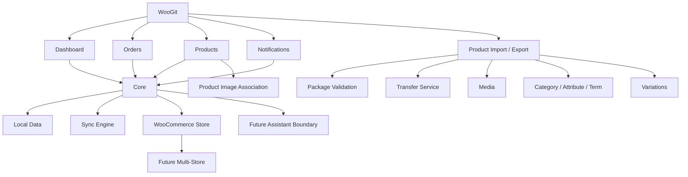

# WooGit — Project Documentation Map

این فایل نقشه‌ی مرکزی مستندات پروژه است.

## Source of Truth hierarchy

### 1. `CURRENT_IMPLEMENTATION.md`
مرجع وضعیت واقعی implementation فعلی است؛ شامل مرزهای اجرایی، رفتارهای پیاده‌شده و قراردادهای حساس مانند مسیر تصویر محصول.

### 2. `IMPLEMENTATION_STATUS.md`
Snapshot اجرایی قابلیت‌های فعلی، به‌خصوص Product Import/Export، modeها، progress، safety و محدودیت‌های واقعی کد.

### 3. `PRODUCT_VISION.md`
مرجع «چه چیزی می‌سازیم و چرا؟» است.

### 4. `ARCHITECTURE.md`
مرجع «چطور باید ساخته شود؟» است.

### 5. `V1_*` contracts
قراردادهای اجرایی V1 هستند و باید با implementation فعلی سازگار بمانند.

### 6. `ROADMAP.md`
مرجع قابلیت‌های آینده و اولویت‌بندی نسخه‌هاست؛ roadmap به‌تنهایی implementation را اثبات نمی‌کند.

## موضوعات اصلی

- `ORDERS_AND_PRODUCTS.md` — رفتار عملیاتی سفارش و محصول.
- `PRODUCT_IMPORT_EXPORT.md` — قرارداد و جزئیات انتقال Product/Variation/Media.
- `IMPLEMENTATION_STATUS.md` — snapshot رفتار فعلی implementation.
- `V1_API_CONTRACT.md` — مرز WooCommerce REST API و قرارداد mutationها.
- `CONNECTION_AND_SYNC.md` — اتصال، Sync و reconciliation.
- `OFFLINE_QUEUE_AND_PUSH.md` — queue و push.
- `CONFLICT_RESOLUTION.md` — conflict handling.
- `NOTIFICATIONS_AND_EVENTS.md` — event و notification.
- `SECURITY_AND_PERMISSIONS.md` — امنیت و سطح دسترسی.
- `PROJECT_MAP.md` — همین نقشه.

## قوانین قطعی مستندات

1. دستور صریح و جدید کاربر بر مستندات قبلی مقدم است.
2. بعد از تصمیم جدید، سند مربوط باید به‌روزرسانی شود.
3. README نمای کلی است؛ جزئیات در docs نگهداری می‌شوند.
4. هیچ قابلیت موجود بدون تصمیم صریح حذف نمی‌شود.
5. قابلیت آینده نباید به‌عنوان implemented نوشته شود.
6. تغییرات کد باید حداقلی باشند و diff آن‌ها قبل از commit بررسی شود.
7. برای رفع CI نباید منطق موجود حذف یا با نسخه ناقص جایگزین شود.
8. تغییر مستندات نباید به‌صورت ناخواسته کد یا قرارداد اجرایی را تغییر دهد.

## Knowledge Graph

